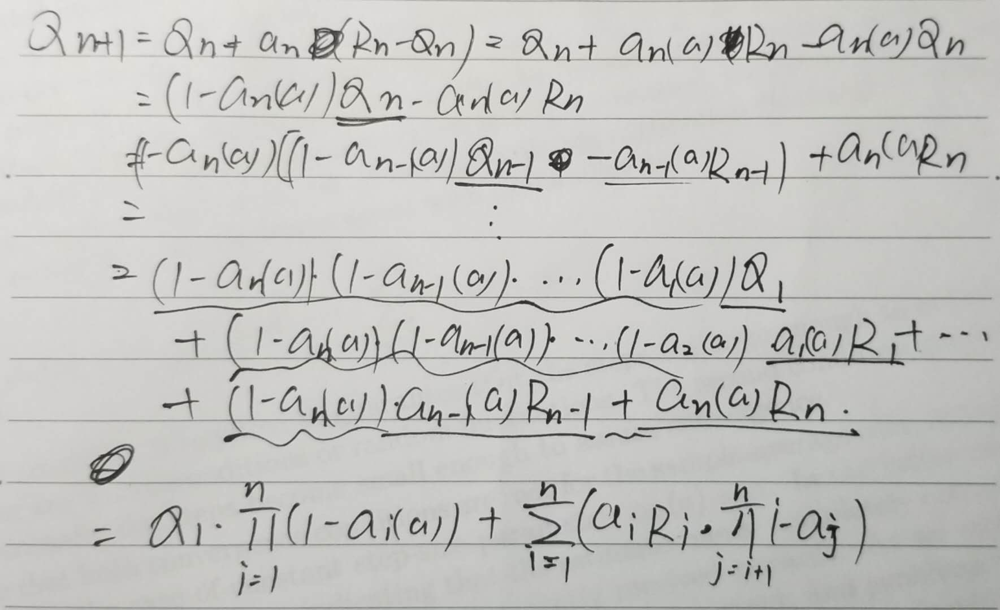

2.1

​	$$ P_{greedy-action} = (1-\epsilon)*1+\epsilon*0.5=0.75 $$

2.2

​	Definitely occurred: 2, 5

​	Might occurred: 1, 3, 4

2.3

​	For $\epsilon=0.1$, $P_{best action}= (1-\epsilon)*1+\epsilon*\frac{1}{10}=0.91$;

​	for $\epsilon=0.01$, $P_{best action}= (1-\epsilon)*1+\epsilon*\frac{1}{10}=0.991$.

​	$\epsilon=0.01$ will perform better in the long run.

2.4

​	$$ Q_{n+1}=Q_1* \prod_{i=1}^{n}(1- \alpha_i(a))+\sum_{i=1}^{n}( \alpha_i R_i*\prod_{j=i+1}^{n}(1-\alpha_j)) $$	

2.5

2.6

​	When agent find the optimal value in early steps, it will choose this action due to the greedy policy. So the estimate of optimal value would converge to the true value slowly.

2.7 **

2.8

​	Since when $N_t(a)=0$, a is considered to be the maximizing action, agent would go through all actions in the first 10 steps, then with some of a is not equal to 0, agent will then choose the action based on greedy policy on the 11th step. And agent will continue choose same action until $\ln(t)$ is greater then $N_t(a)$ for some other action, which means the agent begins to do exploration and the reward would decrease.

2.9
​	for two actions a and b, $Pr(A_t=a) =\frac{e^{H_t(a)}}{e^{H_t(a)}+e^{H_t(b)}}$, and assume $x=H_t(a)-H_t(b)$, then $Pr(A_t=a)=\frac{1}{1+e^{-x}}$, which is the sigmoid function.

2.10

​	Case unknown, best expectation=0.5,randomly choose; Case known, best expectation=0.55: for case A, choose action 2, for case B, choose action 1.

2.11