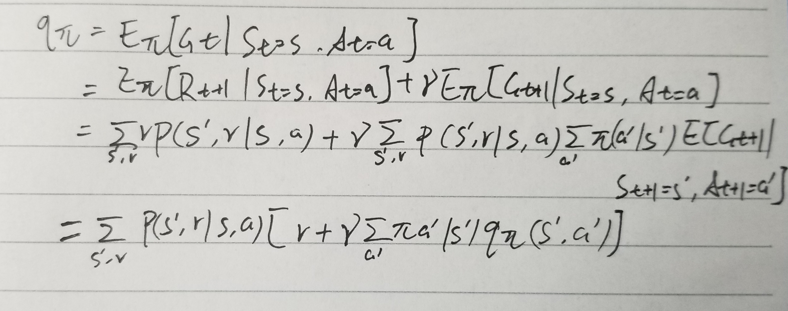

3.1

​	Robot finding path in a maze. Action: moving forward or make a turn; Reward: distance to the exit.

3.2

​	It depends on whether the goal-directed task has the Markov property. Like weather forecast.

3.3

​	It depends on the definition of the task.

3.4

| s    | a        | s'   | r              | $p(s'|s,a)$ |
| ---- | -------- | ---- | -------------- | ----------- |
| high | search   | high | $r_{research}$ | $\alpha$    |
| high | search   | low  | $r_{research}$ | $1-\alpha$  |
| low  | search   | high | -3             | $1-\beta$   |
| low  | search   | low  | $r_{research}$ | $\beta$     |
| high | wait     | high | $r_{wait}$     | 1           |
| low  | wait     | low  | $r_{wait}$     | 1           |
| low  | recharge | high | 0              | 1           |

3.5

​	$$ \sum_{s'\in S^+}\sum_{r\in R}p(s',r|s,a)=1 $$

3.6

​	The return value would be -1 if failure and 0 if not failure, then $G_t=-\gamma^{T-t}$. And in 

continuing case, $G_t=-\sum_{k\in K}\gamma^{k-t}$, where K is the set of times which the pole falls over.

3.7

​	Agent may not be able to find the exit, and for some instance it may stuck in a loop.

3.8

​	$G_0=2, G_1=3, G_2=2, G_3=0.5, G_4=1/8, G_5=0$

3.9

​	$G_1=63, G_0=65$

3.10

​	$$ G_k=\sum \gamma^k ​$$

​	$$ \gamma G_k-G_k=\gamma^{k+1}-1  $$

​	$$ G_k=\frac{1-\gamma^{k+1}}{1-\gamma}$$

​	$$ G= \lim G_k=\frac{1}{1-\gamma}$$

3.11

​	$$ E[R_{t+1}|S_t=s]=\sum_a\pi(a|S_t)\sum_{s',r}rp(s',r|S_t,a) $$

3.12

​	based on (3.14), 

​	$$ v_\pi(center)=\frac{1}{4}*0.9*\sum_{s'}v_\pi(s')=0.25*0.9*(2.3+0.4-0.4+0.7)=0.675 $$

3.13	

3.14

​	$v_c=\frac{c}{1-\gamma}$. Since $v_c$ is added to every v, then it wont affect the selection.

3.15

​	It would have no effect. If c >0, then the reward would be infinite, and if c<0, there is no change with or without c.

3.16

​	$$ v_\pi(s)=E_\pi[q_\pi(S_t,A_t)|S_t=s, A_t=a] $$	

​       		   $$ =\sum_aq_\pi(s,a)\pi(a|s) $$

3.17

​	$$ q_\pi(s,a)=E_\pi[R_{t+1}+v_\pi(s')|S_t=s, A+t=a] $$

​			$$ =\sum_{s',r}p(a',r|s,a)(r+v_\pi(s')) $$

3.18

​	for the area out of green, the optimal action-value function would be like the part in $q_*(s, driver)$, and for the area on the green, just like the part in $v_{putt}$ 

3.19

​	exactly like the picture of $v_{putt}$

3.20

​	when $\gamma=0$, left is optimal;

​	when $\gamma=0.9$, right is optimal;

​	when $\gamma=0.5$, it would be the same on left and right

3.21

​	$$ q_*(s,a)=\sum_{s',r}p(s',r|s,a)[r+\gamma v_*(s')] $$

​		, where $v_*(s')=max_aq_*(s,a)$

3.22

​	 $ 24.4=10+16.0*0.9 $, where 0.9 is $\gamma=16.0/17.8$ and 10 is the reward  to A'

3.23

​	$ v_*(s)=\sum_a\pi_*(a|s)q_*(s,a) $

3.24

​	$$ q_*(s,a)=\sum_{s', r}p(s',r|s,a)(r+\gamma v_*(s')) $$

3.25

​	$$ \pi_*(a|s)=argmax_aq_*(s,a) $$

3.26

​	substitute the answer of 3.24 into 3.25,

​	$$ \pi_*(a|s)=argmax_a  \sum_{s', r}p(s',r|s,a)(r+\gamma v_*(s'))  $$

